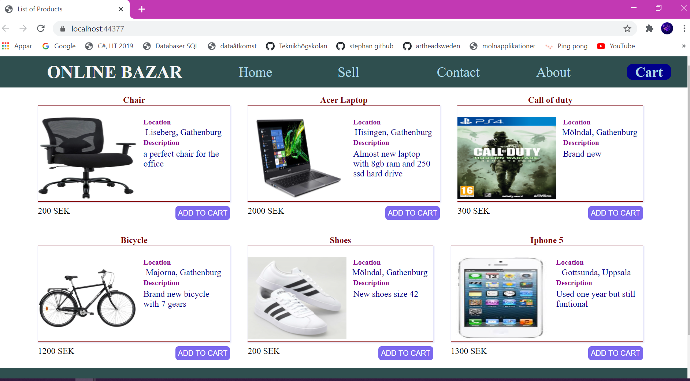

### 2020-09-07

## Databaser i Azure

Storage (GB) tycks överlag vara väldigt billigt på cirka 1 kr per GB. Datorkraft är desto dyrare.

## Prisjämförelse budgetalternativ
### Azure SQL Databas
För låg performance har vi hittat ett alternativ med följande inställningar:

Med DTU purchase model väljer vi S0 performance level. Vi väljer serviceless och på Service tier väljer vi  Standard. 

**Kostnaden för en månad uppskattas till 128 kr.**

### Cosmos DB
Ett lågt performance alternativ, såsom för testning, har vi hittat med följande. Vi väljer Database operations Serveless, och skruvar upp storage size till 5 GB.

**Kostnaden blir 141kr  per månad**.

### Maria DB
Vi väljer ett basic alternativ. Här finns inte alternativ för DTU köpesmodellen, så vi väljer 1 vCore. 5 GB storage och 1 server på 730 timmar.

**Kostnaden blir 236 kr per månad**.

### MySQL
Tier Basic
Gen 5, 1 vCore

Vi väljer Pay as you go, 1 server 730 timmar (1 månad)
5 GB storage

**Total kostnad per månad blir 237 kr.**


## Prisjämförelser Standard varianter
Vi har gjort en jämförelse mellan en relationsdatabas (Azure SQL) och en NoSQL databas (CosmosDB)

### Azure SQL Databas
Gällande för Azure SQL Databas är att vCore purchase modellen är väldigt dyr. 

För  standardinställningar är SQL Databas väldigt dyr. Vi drar ner lite på prestandan för ett standardalternativ med 4 vCore landar vi på **6500 kr per månad.**

### Cosmos DB
För Cosmos DB, med standardalternativ, skruvar vi enbart upp lagringsutrymmet till 32 GB för att matcha vår SQL Databas jämförelse. **Kostnaden blir då bara 273 kr per månad.** Alltså ett väldigt mycket billigare alternativ än SQL Databas med standard inställningar. 

### Konfigurera database på azure med CLI
Först ser man till att man har en resurgrupp annars kan man skapa en med följande command: 
```bash
 az group create --name {resource name} --location {location name}
```
Nästa steg är att skapa en server som databasen kan köras på och det gör vi med följande command:
```bash
az sql server create --name {server name} --resource-group {resource name} --location {location name} --admin-user {user name} --admin-password {password}
```
För att komma åt databasen behöver vi konfigurera en firewall regel eftersom som default det är sluten. Detta gör vi med denna command: 
```bash
az sql server firewall-rule create --resource-group {Your resource name} --server {your server name} -n AllowYourIp --start-ip-address {your Ip adress} --end-ip-address {your IP adress}
```
Sista steg är att skapa databas och det gör vi genom denna command
```bash
az sql db create --resource-group {Resource name} --server {server name} --name {database name} --sample-name AdventureWorksLT
```
### Online Bazar
Online Bazar är en webapplikation som är tänkt som (Blocket.se). Den har några färdiga modeller som vi vill skapa tabeller utifrån och lägga till i vår databas som vi skapade med ovanstående metod.

Vi plockar connectionstringen från azure portalen och lägger den i appsettings.json, därefter läser vi vår connectionstring. Härifrån kan vi göra en databasmigration. 

Nu har vi skapat våra tabeller och den kan man se på azure portalen. Nästa steg är att lägga in data i vå tabeller och läsa in data i kontroller som vi skickar ut till View.





Det kan vara en fördel att ha separata databas för utvecklingsmiljö för att slippa belastning på produktiondatabasen. 